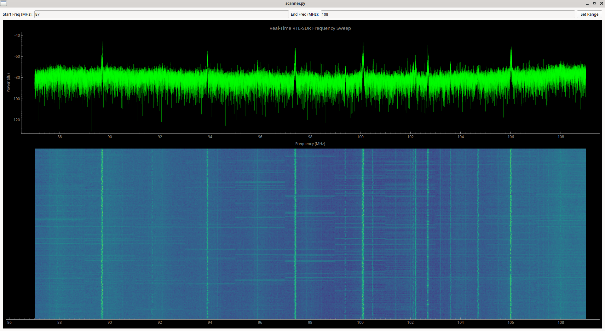

# SDR-wideband-scanner
Basically a full spectrum analyzer in python.
Totally vibe coded, minimum hand cleanup so far. Requires mainly Pyqtplot and rtl-sdr of course, rest are usual python libs.

Most stuff is still hardcoded, relies on 3.2Msps for good refresh rate, but can go slower obviously. Also FFT window can be wider at cost of some roll-off at the edges.
